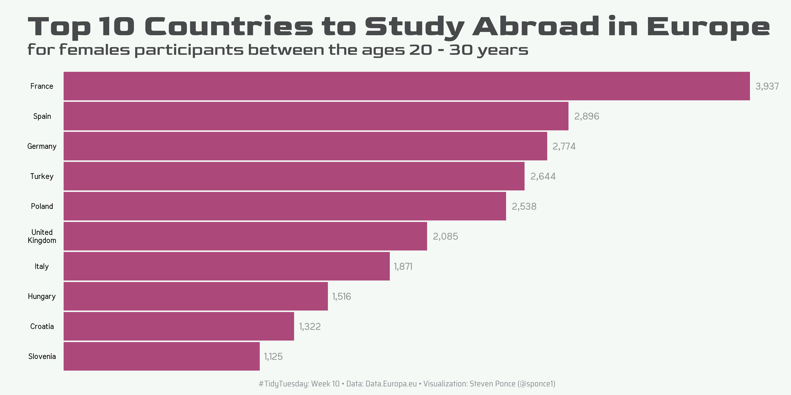
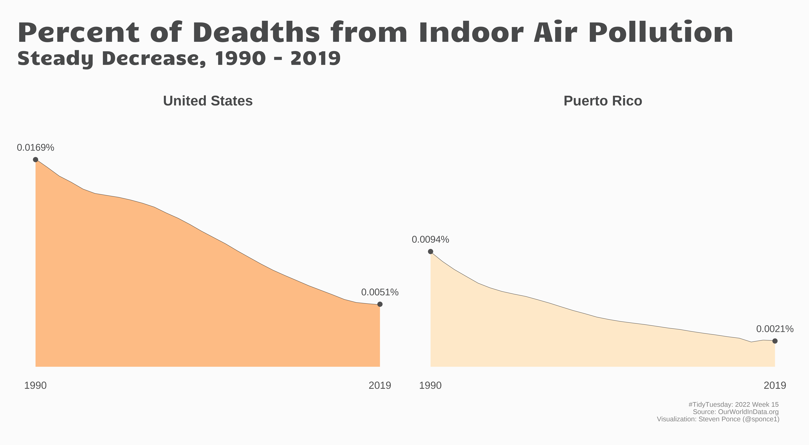
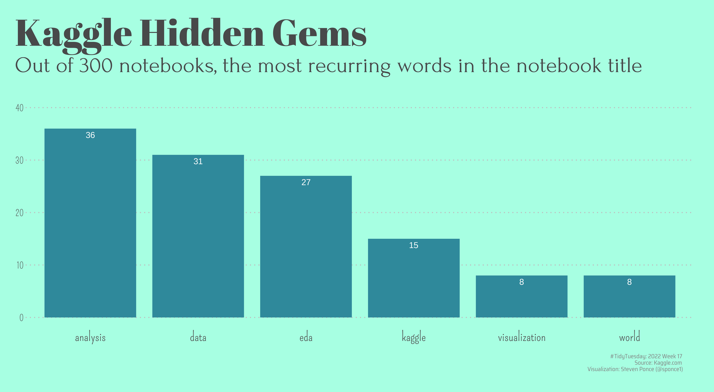
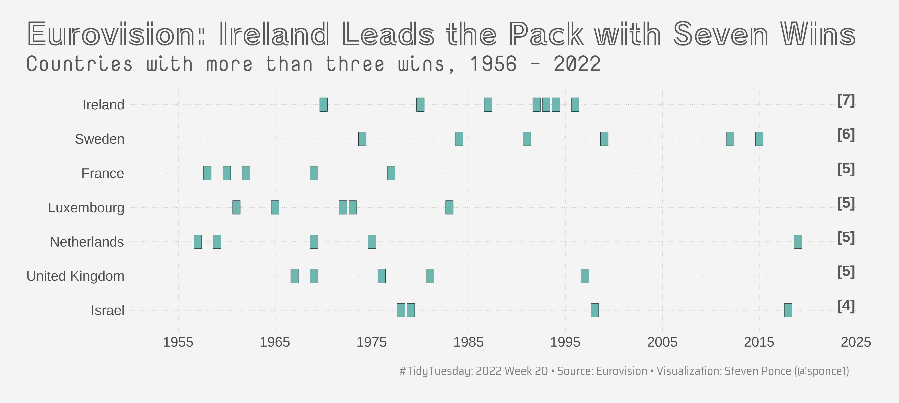
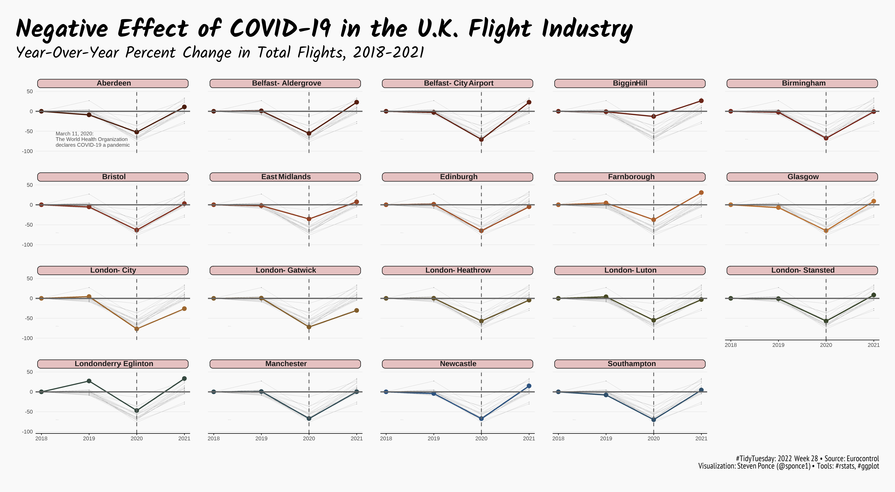

#TidyTuesday Challenge 

<!-- table header, followed by pictures link -->
|[Week 06 Tuskegee Airmen](https://github.com/poncest/tidytuesday/tree/main/2022/Week_06)| [Week 07 DuBois Challenge - plate 12](https://github.com/poncest/tidytuesday/tree/main/2022/Week_07)| [Week 08 World Freedom Index](https://github.com/poncest/tidytuesday/tree/main/2022/Week_08)| [Week 09 Alternative Fuel Stations](https://github.com/poncest/tidytuesday/tree/main/2022/Week_09)|
| :---: | :---: | :---: | :---: 
| | | | | 
[Week 10 Study Abroad](https://github.com/poncest/tidytuesday/tree/main/2022/Week_10)| [Week 11 CRAN/BIOC Vignettes](https://github.com/poncest/tidytuesday/tree/main/2022/Week_11)| [Week 12 US Baby Names](https://github.com/poncest/tidytuesday/tree/main/2022/Week_12)| [Week 13 US Collegiate Sports Budgets](https://github.com/poncest/tidytuesday/tree/main/2022/Week_13) |
 | | | | 
[Week 14 News Organization](https://github.com/poncest/tidytuesday/tree/main/2022/Week_14)| [Week 15 Indoor Air Pollution](https://github.com/poncest/tidytuesday/tree/main/2022/Week_15)|[Week 16 Crossword Puzzles](https://github.com/poncest/tidytuesday/tree/main/2022/Week_16)|[Week 17 US collegiate sports budgets](https://github.com/poncest/tidytuesday/tree/main/2022/Week_17) |
 | | | |
[Week 18 US Solar/Wind](https://github.com/poncest/tidytuesday/tree/main/2022/Week_18)| [Week 19 NYT Bestsellers](https://github.com/poncest/tidytuesday/tree/main/2022/Week_19)|[Week 20 Eurovision](https://github.com/poncest/tidytuesday/tree/main/2022/Week_20)|[Week 21 Women's Rugby](https://github.com/poncest/tidytuesday/tree/main/2022/Week_21) |
 | | | |
[Week 22 Company Reputation](https://github.com/poncest/tidytuesday/tree/main/2022/Week_22)| [Week 23 Pride Donations ](https://github.com/poncest/tidytuesday/tree/main/2022/Week_23)| [Week 24 U.S. Drought ](https://github.com/poncest/tidytuesday/tree/main/2022/Week_24) | [Week 25 No Submission ](2022_24/Week_25) |
 | | | |
[Week 26 UK Pay Gap](https://github.com/poncest/tidytuesday/tree/main/2022/Week_26)| [Week 27 San Francisco Rentals](https://github.com/poncest/tidytuesday/tree/main/2022/Week_27)| [Week 28 European Flights](https://github.com/poncest/tidytuesday/tree/main/2022/Week_28)| [Week 29 XYZ](2022_21/Week_21) |
 | |  | | 

