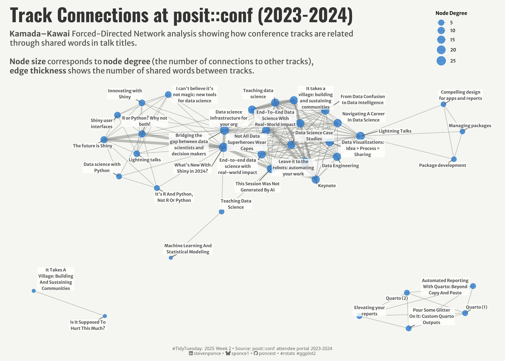
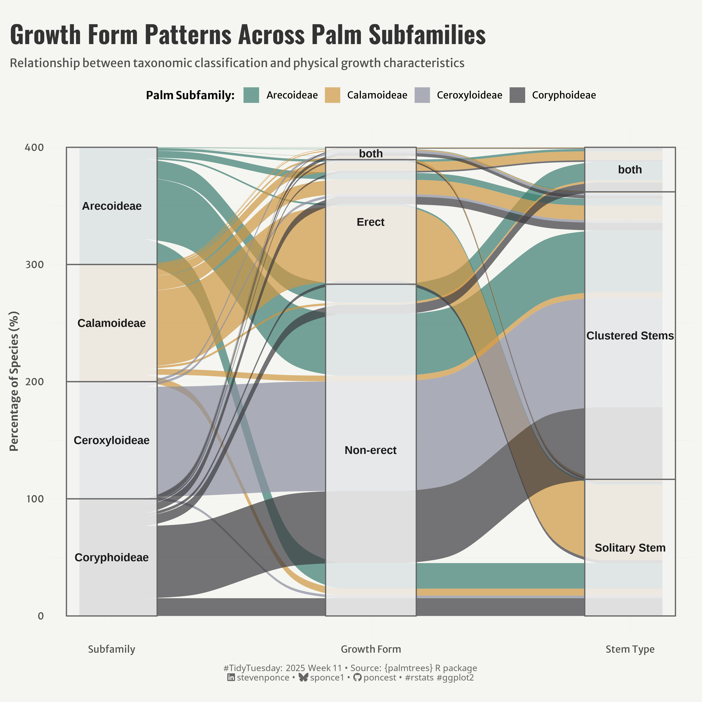

# #TidyTuesday Challenge

| [Week 01 Bring your Own Data](https://github.com/poncest/tidytuesday/tree/main/2025/Week_01) | [Week 02](https://github.com/poncest/tidytuesday/tree/main/2025/Week_02)[ ](https://github.com/poncest/tidytuesday/tree/main/2025/Week_01)[posit::conf talks](https://github.com/poncest/tidytuesday/tree/main/2025/Week_02) | [Week 03](https://github.com/poncest/tidytuesday/tree/main/2025/Week_03)[ ](https://github.com/poncest/tidytuesday/tree/main/2025/Week_01)[The History of Himalayan Mountaineering Expeditions](https://github.com/poncest/tidytuesday/tree/main/2025/Week_03) | [Week 04](https://github.com/poncest/tidytuesday/tree/main/2025/Week_04)[ ](https://github.com/poncest/tidytuesday/tree/main/2025/Week_01)[Water Insecurity](https://github.com/poncest/tidytuesday/tree/main/2025/Week_04) |
|:----------------:|:----------------:|:----------------:|:----------------:|
|  |  |  |  |
| [Week 05](https://github.com/poncest/tidytuesday/tree/main/2025/Week_05)[ ](https://github.com/poncest/tidytuesday/tree/main/2025/Week_01)[Donuts, Data, and D'oh - A Deep Dive into The Simpsons](https://github.com/poncest/tidytuesday/tree/main/2025/Week_05) | [Week 06](https://github.com/poncest/tidytuesday/tree/main/2025/Week_06)[ ](https://github.com/poncest/tidytuesday/tree/main/2025/Week_01)[CDC Datasets](https://github.com/poncest/tidytuesday/tree/main/2025/Week_06) | [Week 07](https://github.com/poncest/tidytuesday/tree/main/2025/Week_07)[ ](https://github.com/poncest/tidytuesday/tree/main/2025/Week_01)[Agencies from the FBI Crime Data API](https://github.com/poncest/tidytuesday/tree/main/2025/Week_07) | [Week 08](https://github.com/poncest/tidytuesday/tree/main/2025/Week_08)[ ](https://github.com/poncest/tidytuesday/tree/main/2025/Week_01)[Academic Literature on Racial and Ethnic Disparities in Reproductive Medicine in the US](https://github.com/poncest/tidytuesday/tree/main/2025/Week_08) |
|  |  |  |  |
| [Week 09](https://github.com/poncest/tidytuesday/tree/main/2025/Week_09)[ ](https://github.com/poncest/tidytuesday/tree/main/2025/Week_01)[Long Beach Animal Shelter](https://github.com/poncest/tidytuesday/tree/main/2025/Week_09) | [Week10](https://github.com/poncest/tidytuesday/tree/main/2025/Week_10)[ ](https://github.com/poncest/tidytuesday/tree/main/2025/Week_01)[Pixar Films](https://github.com/poncest/tidytuesday/tree/main/2025/Week_10) | [Week11](https://github.com/poncest/tidytuesday/tree/main/2025/Week_11)[ ](https://github.com/poncest/tidytuesday/tree/main/2025/Week_01)[Palm Trees](https://github.com/poncest/tidytuesday/tree/main/2025/Week_11) | [Week12](https://github.com/poncest/tidytuesday/tree/main/2025/Week_12)[ ](https://github.com/poncest/tidytuesday/tree/main/2025/Week_01)[Text Data From Amazon's Annual Reports](https://github.com/poncest/tidytuesday/tree/main/2025/Week_12) |
|  |  |  |  |
| [Week13](https://github.com/poncest/tidytuesday/tree/main/2025/Week_13)[ ](https://github.com/poncest/tidytuesday/tree/main/2025/Week_01)[Pokemon](https://github.com/poncest/tidytuesday/tree/main/2025/Week_13) | [Week15](https://github.com/poncest/tidytuesday/tree/main/2025/Week_15)[ ](https://github.com/poncest/tidytuesday/tree/main/2025/Week_01)[Base R Penguins](https://github.com/poncest/tidytuesday/tree/main/2025/Week_15) | [Week16](https://github.com/poncest/tidytuesday/tree/main/2025/Week_16)[ ](https://github.com/poncest/tidytuesday/tree/main/2025/Week_01)[Fatal Car Crashes on 4/20](https://github.com/poncest/tidytuesday/tree/main/2025/Week_16) | [Week17](https://github.com/poncest/tidytuesday/tree/main/2025/Week_17)[ ](https://github.com/poncest/tidytuesday/tree/main/2025/Week_01)[useR! 2025 program](https://github.com/poncest/tidytuesday/tree/main/2025/Week_17) |
|  |  |  |  |
| [Week18](https://github.com/poncest/tidytuesday/tree/main/2025/Week_18)[ ](https://github.com/poncest/tidytuesday/tree/main/2025/Week_01)[National Science Foundation Grant Terminations under the Trump Administration](https://github.com/poncest/tidytuesday/tree/main/2025/Week_18) | [Week19](https://github.com/poncest/tidytuesday/tree/main/2025/Week_19)[ ](https://github.com/poncest/tidytuesday/tree/main/2025/Week_01)[Seismic Events at Mount Vesuvius](https://github.com/poncest/tidytuesday/tree/main/2025/Week_19) | [Week20](https://github.com/poncest/tidytuesday/tree/main/2025/Week_20)[ ](https://github.com/poncest/tidytuesday/tree/main/2025/Week_01)[Water Quality at Sydney Beaches](https://github.com/poncest/tidytuesday/tree/main/2025/Week_20) | [Week21](https://github.com/poncest/tidytuesday/tree/main/2025/Week_21)[ ](https://github.com/poncest/tidytuesday/tree/main/2025/Week_01)[Dungeons and Dragons Monsters (2024)](https://github.com/poncest/tidytuesday/tree/main/2025/Week_21) |
|  |  |  |  |
| [Week22](https://github.com/poncest/tidytuesday/tree/main/2025/Week_22)[ ](https://github.com/poncest/tidytuesday/tree/main/2025/Week_01)[Project Gutenberg](https://github.com/poncest/tidytuesday/tree/main/2025/Week_22) | [Week23](https://github.com/poncest/tidytuesday/tree/main/2025/Week_23)[ ](https://github.com/poncest/tidytuesday/tree/main/2025/Week_01)[U.S. Judges and the historydata R package](https://github.com/poncest/tidytuesday/tree/main/2025/Week_23) | [Week24](https://github.com/poncest/tidytuesday/tree/main/2025/Week_24)[ ](https://github.com/poncest/tidytuesday/tree/main/2025/Week_01)[APIs.guru](https://github.com/poncest/tidytuesday/tree/main/2025/Week_24) |  |
|  |  |  |  |
|  |  |  |  |
