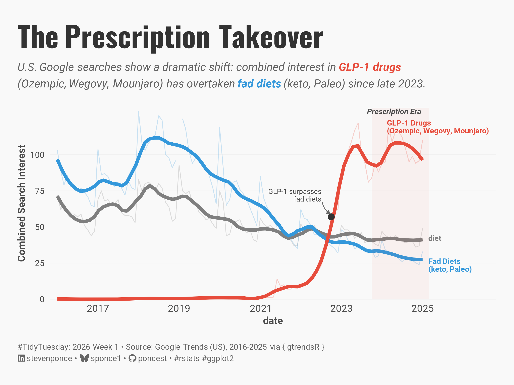
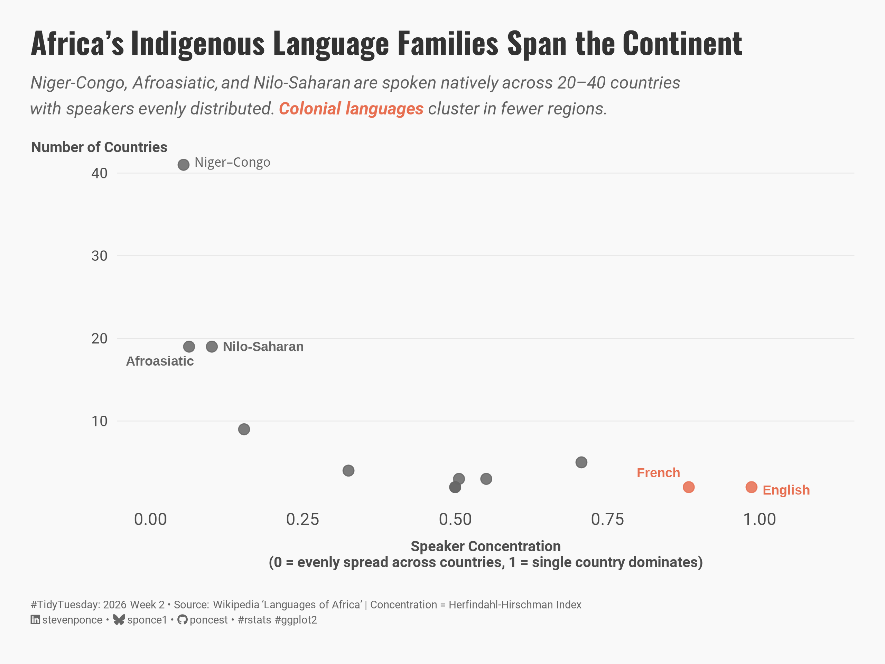
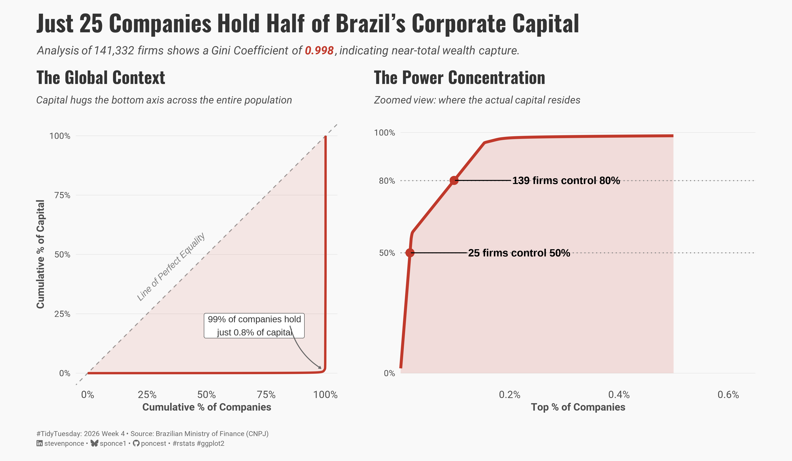
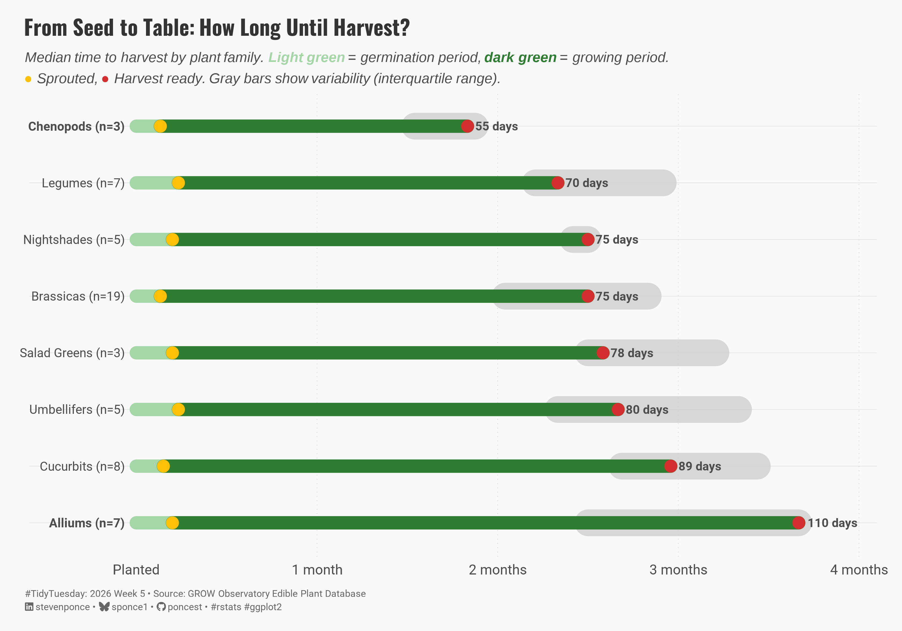

# #TidyTuesday Challenge

| [Week 01 Bring your Own Data](https://github.com/poncest/tidytuesday/tree/main/2026/Week_01) | [Week 02 The Languages of Africa](https://github.com/poncest/tidytuesday/tree/main/2026/Week_02) | [Week 04 Brazilian Companies](https://github.com/poncest/tidytuesday/tree/main/2026/Week_04) | [Week 05 Edible Plants Database](https://github.com/poncest/tidytuesday/tree/main/2026/Week_05) |
|:----------------:|:----------------:|:----------------:|:----------------:|
|  |  |  |  |
|  |  |  |  |
|  |  |  |  |
|  |  |  |  |
|  |  |  |  |
|  |  |  |  |
|  |  |  |  |
|  |  |  |  |
|  |  |  |  |
|  |  |  |  |
|  |  |  |  |
|  |  |  |  |
|  |  |  |  |
|  |  |  |  |
|  |  |  |  |
|  |  |  |  |
|  |  |  |  |
|  |  |  |  |
|  |  |  |  |
|  |  |  |  |
|  |  |  |  |
|  |  |  |  |
|  |  |  |  |
|  |  |  |  |
|  |  |  |  |
