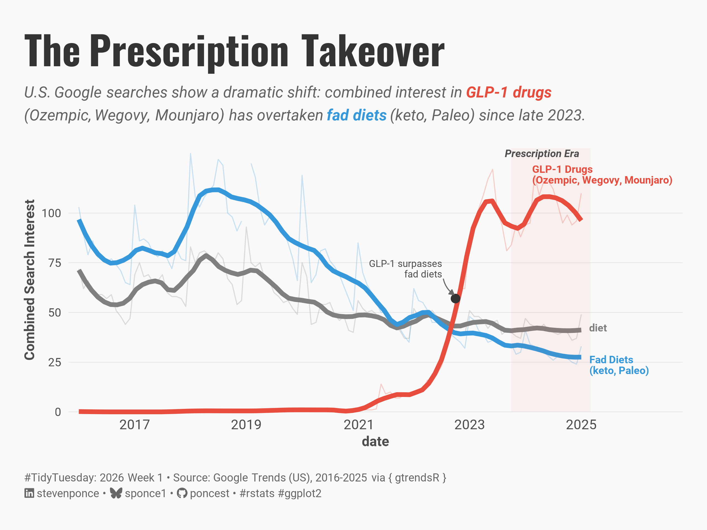
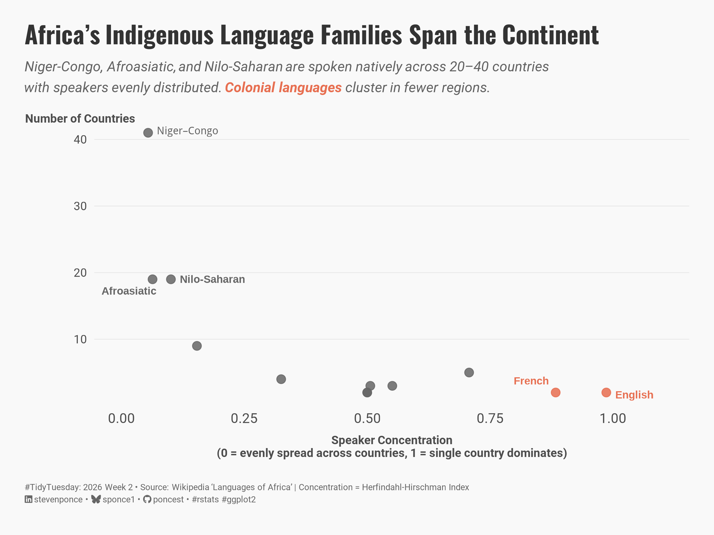
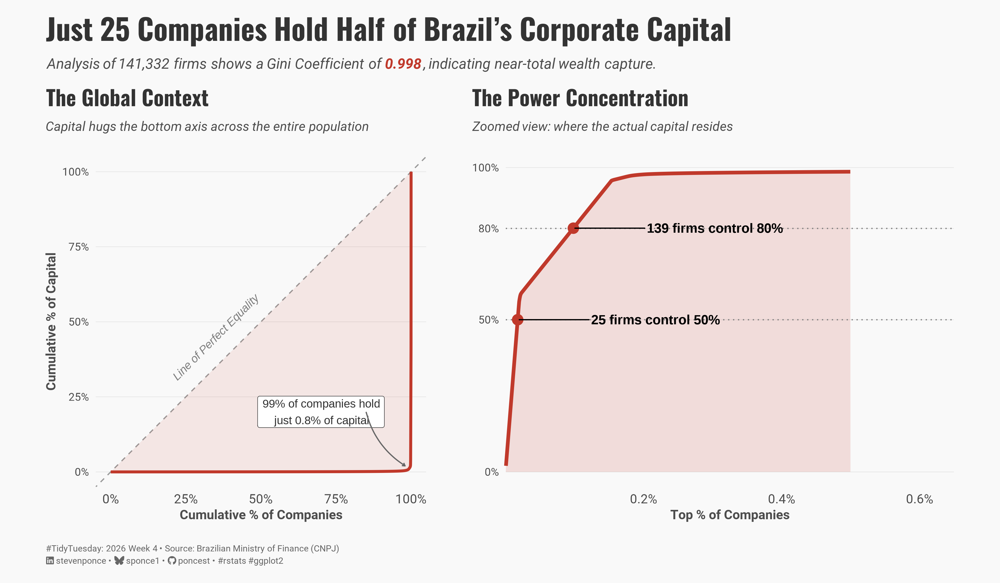
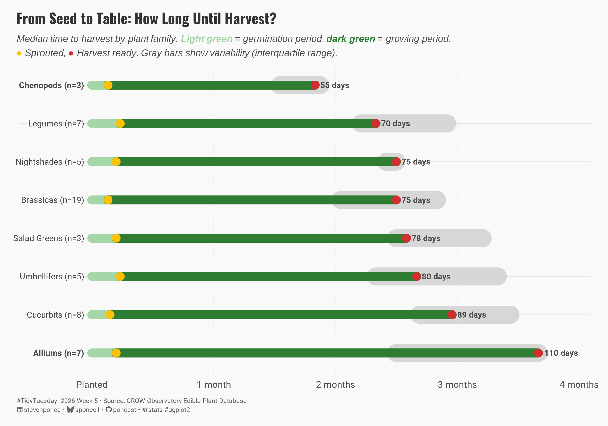
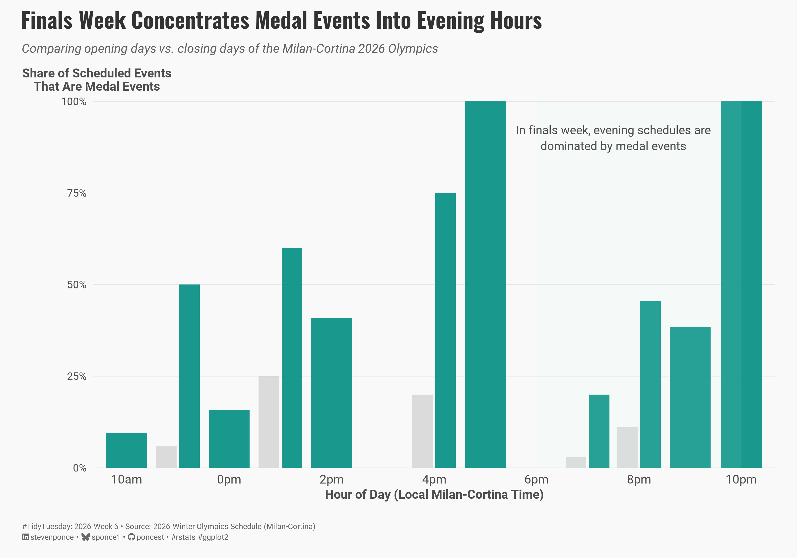
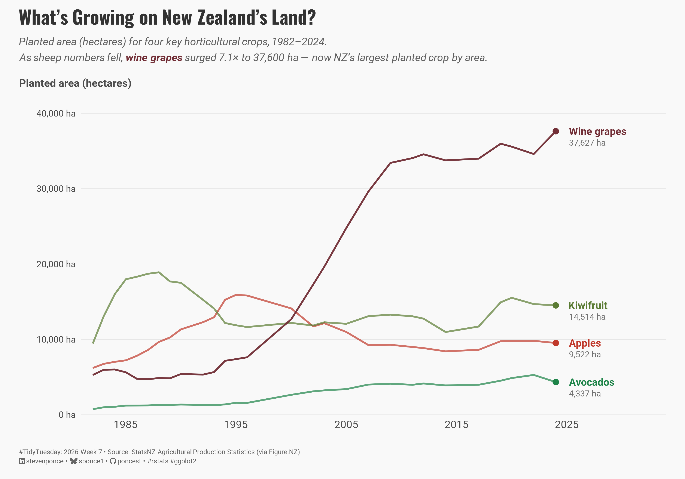
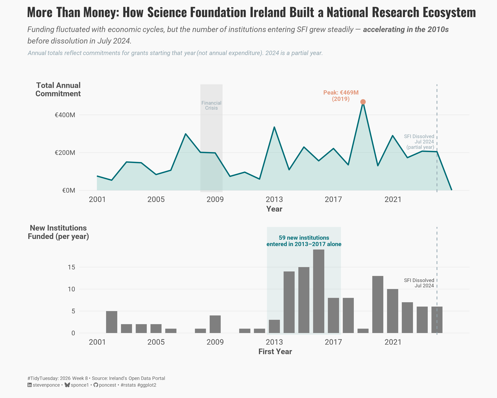
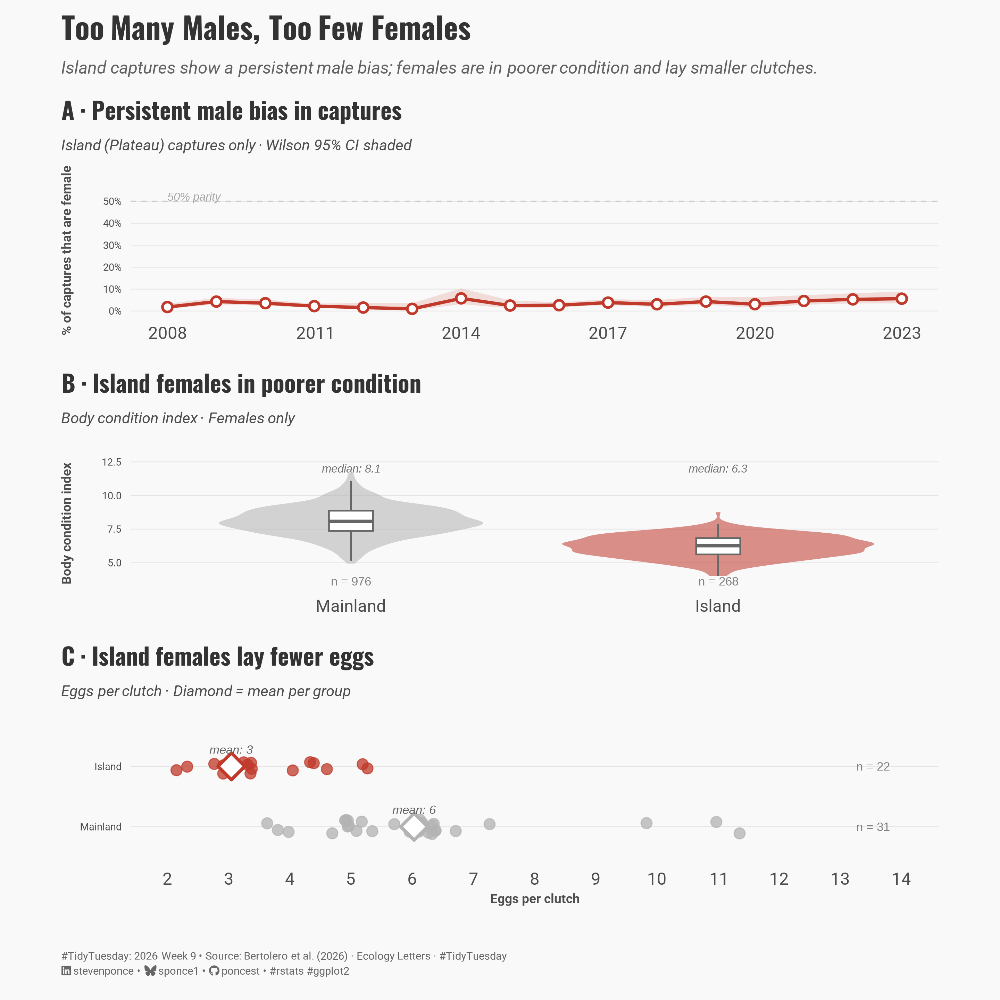
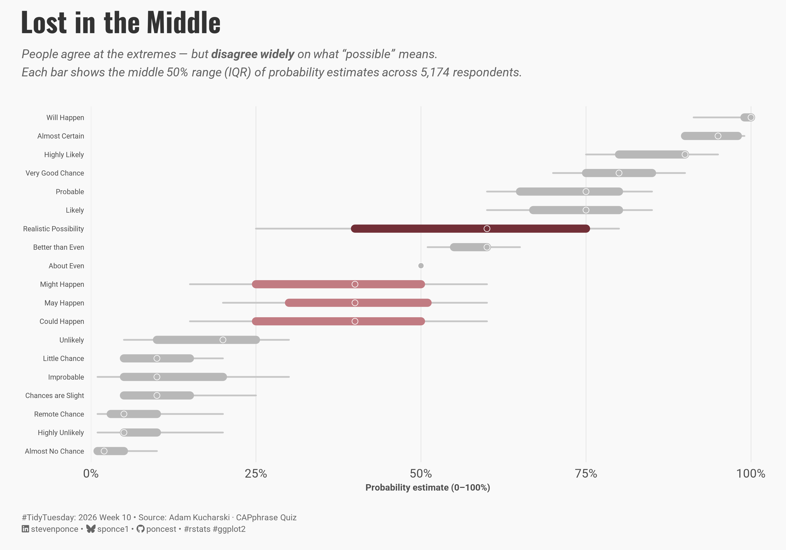

# #TidyTuesday Challenge

| [Week 01 Bring your Own Data](https://github.com/poncest/tidytuesday/tree/main/2026/Week_01) | [Week 02 The Languages of Africa](https://github.com/poncest/tidytuesday/tree/main/2026/Week_02) | [Week 04 Brazilian Companies](https://github.com/poncest/tidytuesday/tree/main/2026/Week_04) | [Week 05 Edible Plants Database](https://github.com/poncest/tidytuesday/tree/main/2026/Week_05) |
|:--:|:--:|:--:|:--:|
|  |  |  |  |
| [Week 06 2026 Winter Olympics!](https://github.com/poncest/tidytuesday/tree/main/2026/Week_06) | [Week 07 Agricultural Production Statistics in New Zealand](https://github.com/poncest/tidytuesday/tree/main/2026/Week_07) | [Week 08 Science Foundation Ireland Grants Commitments](https://github.com/poncest/tidytuesday/tree/main/2026/Week_08) | [Week 09 Golem Grad Tortoise Data](https://github.com/poncest/tidytuesday/tree/main/2026/Week_09) |
|  |  |  |  |
| [Week 10 How likely is 'likely'?](https://github.com/poncest/tidytuesday/tree/main/2026/Week_10) | [Week 11 Salmonid Mortality Data](https://github.com/poncest/tidytuesday/tree/main/2026/Week_11) | [Week 12 One Million Digits of Pi](https://github.com/poncest/tidytuesday/tree/main/2026/Week_12) |  |
|  |  |  |  |
|  |  |  |  |
|  |  |  |  |
|  |  |  |  |
|  |  |  |  |
|  |  |  |  |
|  |  |  |  |
|  |  |  |  |
|  |  |  |  |
|  |  |  |  |
|  |  |  |  |
|  |  |  |  |
|  |  |  |  |
|  |  |  |  |
|  |  |  |  |
|  |  |  |  |
|  |  |  |  |
|  |  |  |  |
|  |  |  |  |
|  |  |  |  |
|  |  |  |  |
